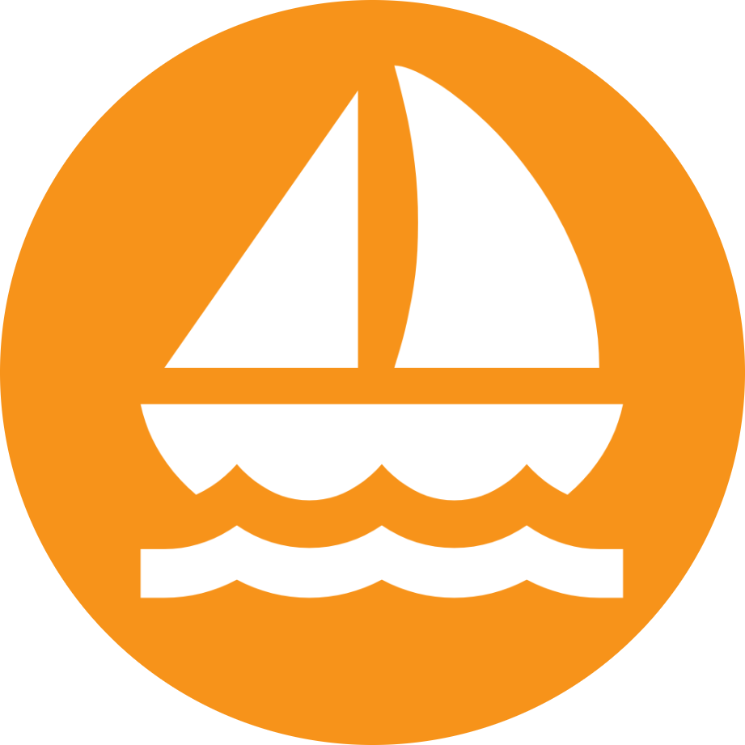

<div align="center">
  
  
  # Odyssey: Bitcoin Resources
  
  *Embark on an epic adventure to master Bitcoin and unlock the future of finance*

[](https://apps.apple.com/us/app/odyssey-your-bitcoin-journey/id6749882142)
[](https://play.google.com/store/apps/details?id=com.odyssey.odysseybtcapp&hl=en_US)

</div>

Ahoy there, sailor! 🏴‍☠️  

This repository is the **ship's log** for helpful resources, glossary terms, and learning tools from the app. ⚓

It will be **continuously updated** with new knowledge, recommended platforms, and treasure maps for your Bitcoin journey.

---

## 📜 What You'll Find Here

- **[Glossary](glossary.md)** – A Bitcoin dictionary with clear explanations, friendly examples, and pirate flair 🏴‍☠️  
- **[Resources](resources.md)** – Curated exchanges, wallets, learning materials, and tools for all experience levels 🧭
- **[Videos](videos.md)** – Beginner videos that simplify the learning needed to understand Bitcoin and why it's needed 🌊   
- **Guides & Tips** – Best practices for self-custody, security, and safe sailing on the Bitcoin seas (coming soon!) 🗺️  
- **Future Additions** – More categories, adventure quests, and sailor-approved recommendations ⚓

---

## 🛳️ How This Fits Into the Odyssey App

The **Odyssey** app is your trusty ship in the world of Bitcoin:  
- 🎯 **Beginner-Friendly** – Learn the ropes at your own pace  
- 🌌 **Adventure-Themed** – Earn rewards by completing Bitcoin quests  
- 🧭 **Price Compass** – Stay on course with real-time Bitcoin price tracking  
- 💰 **DCA Treasure Planner** – Map out your Bitcoin investments over time  
- 🤝 **Community** – Share your journey with other sailors  

While the app is the **interactive adventure**, this repo is the **knowledge dock** where we store and maintain important resources.

---

## ⚓ Contributing

We welcome contributions from fellow sailors! 🏴‍☠️  
If you’ve discovered a new resource, term, or treasure worth sharing, here’s how to add it to our ship’s log:

1. **Fork** this repository  
2. Create a new branch:  
   ```bash
   git checkout -b add-new-resource
